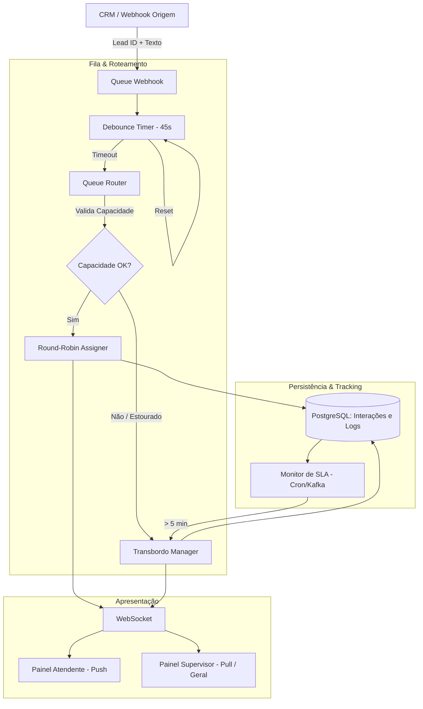

# Módulo de Fila de WhatsApp - Observabilidade e Atendimento

Este plano descreve o design e a arquitetura para o novo módulo de Fila de WhatsApp. O foco principal é garantir observabilidade das transações, rastreamento de SLA, e métricas em tempo real para os atendentes, servindo como uma ponte inteligente entre o CRM e o Atendimento.

## User Review Required

> [!IMPORTANT]
> **Aprovação Necessária:** Revise o plano refinado com base nas suas definições (Janela de Silêncio, SLA Híbrido, Push/Pull). Se tudo estiver correto, me dê o sinal verde para gerar as *Tasks* e iniciar a codificação (Fase 4 - Implementação).

---

## Proposed Changes e Regras de Negócio Definidas

### 1. Regras de Negócio e Comportamento da Fila

1. **Debounce (Janela de Silêncio):**
   - **Mecânica:** Janela de 30 a 45 segundos.
   - **Fluxo:** Primeira mensagem -> Fila com status `RECEBIDO`. Mensagens adicionais na janela resetam o timer. Quando expirar -> status `AGUARDANDO_ATENDIMENTO` e notifica o atendente.
   - **Vantagem:** Impede a inflação artificial de carga de trabalho nas métricas.

2. **SLA e Transbordo (Híbrido):**
   - **Regra de Tempo:** > 5 minutos em `AGUARDANDO_ATENDIMENTO` -> `TRANSBORDADO`.
   - **Regra de Capacidade:** Se todos os atendentes online estiverem no limite (ex: 5 chats ativos), novo lead entra direto como `TRANSBORDADO`.
   - **Ação:** Disparo de alerta em canal de supervisão ou mensagem de auto-reply de alta demanda.

3. **Distribuição (Push / Pull):**
   - **Atendentes (Push):** Round-Robin (roleta) apenas para atendentes com status "Online".
   - **Supervisores (Pull):** "Fila Geral" estilo salva-vidas, permitindo "puxar" atendimentos importantes ou parados.

---

### 2. Arquitetura do Sistema (Integração CRM -> WhatsApp)



---

### 3. Estrutura do Banco de Dados (Schema)

#### Tabela Principal: `whatsapp_interaction_queue`
```sql
CREATE TABLE whatsapp_interaction_queue (
    id UUID PRIMARY KEY,
    lead_id UUID REFERENCES lead(id) NOT NULL,
    status VARCHAR(50) NOT NULL, -- RECEBIDO, AGUARDANDO_ATENDIMENTO, EM_ATENDIMENTO, FINALIZADO, TRANSBORDADO
    assigned_agent_id UUID,
    channel VARCHAR(50) DEFAULT 'WHATSAPP',
    created_at TIMESTAMP NOT NULL, -- Entrada na fila (RECEBIDO)
    updated_at TIMESTAMP NOT NULL,
    started_at TIMESTAMP, -- Quando passou para EM_ATENDIMENTO
    finished_at TIMESTAMP, -- Quando passou para FINALIZADO
    metadata JSONB -- Histórico de mensagens cacheadas
);
```

#### Tabela de Atendentes (Disponibilidade e Carga)
```sql
CREATE TABLE agent_status (
    agent_id UUID PRIMARY KEY, -- Referência à tabela de usuários/atendentes
    is_online BOOLEAN DEFAULT false,
    active_chats_count INTEGER DEFAULT 0,
    max_capacity INTEGER DEFAULT 5
);
```

#### Tabela de Rastreabilidade: `interaction_status_logs`
```sql
CREATE TABLE interaction_status_logs (
    id UUID PRIMARY KEY,
    interaction_id UUID REFERENCES whatsapp_interaction_queue(id),
    previous_status VARCHAR(50),
    new_status VARCHAR(50),
    transitioned_at TIMESTAMP NOT NULL,
    reason VARCHAR(255)
);
```

> [!TIP]
> **Cálculo Oficial de Métricas:**
> - **TME (Tempo de Espera):** `started_at - (momento que saiu de RECEBIDO para AGUARDANDO_ATENDIMENTO)`
> - **TMA (Tempo de Atendimento):** `finished_at - started_at`

---

### 4. Exemplo de Fluxo Lógico (Pseudo-código)

```java
public void handleIncomingMessage(UUID leadId, String message) {
    // Verifica/Cria a interação
    Interaction interaction = queueRepo.findActiveByLeadId(leadId);
    
    if (interaction == null) {
        interaction = new Interaction(leadId, Status.RECEBIDO);
        queueRepo.save(interaction);
    } else if (interaction.getStatus() == Status.EM_ATENDIMENTO) {
        // Chat já com o atendente, apenas envia para ele via WebSocket
        interaction.appendChat(message);
        wsService.notifyAgent(interaction.getAgentId(), message);
        return;
    }
    
    // Status = RECEBIDO -> Lógica de Janela de Silêncio
    interaction.appendChat(message);
    queueRepo.save(interaction);
    
    // Reseta/Inicia o Timer no Redis ou Job Scheduler (30~45s)
    debounceTimer.scheduleOrReset(leadId, 45, TimeUnit.SECONDS, () -> {
        // Ao estourar o timer de silêncio:
        Interaction readyChat = queueRepo.findById(interaction.getId());
        
        // Regra de Capacidade
        Agent targetAgent = roundRobinService.getNextAvailableAgent();
        if (targetAgent == null || targetAgent.getActiveChats() >= 5) {
            // Estourou capacidade
            readyChat.setStatus(Status.TRANSBORDADO);
            alertService.notifySupervisor("Capacidade estourada para o Lead: " + leadId);
        } else {
            // Push
            readyChat.setStatus(Status.AGUARDANDO_ATENDIMENTO);
            readyChat.setAssignedAgentId(targetAgent.getId());
            targetAgent.incrementActiveChats(); // Atomic increment
            wsService.notifyAgent(targetAgent.getId(), "Novo chat atribuído");
        }
        
        queueRepo.save(readyChat);
        logTransition(readyChat.getId(), Status.RECEBIDO, readyChat.getStatus());
    });
}
```

## Verification Plan

### Testes a serem Implementados
1. **Debounce Service:** Enviar 3 mensagens em menos de 45s e validar que o status continua `RECEBIDO`. Esperar 46s e validar a transição.
2. **Round-Robin Service:** Com 2 atendentes (Online, cap 5), enviar 2 interações e garantir que cai uma para cada (equidade).
3. **Capacity Transbordo:** Com os 2 atendentes lotados (5 chats cada), inserir a 11ª interação e confirmar transição direta para `TRANSBORDADO`.
4. **Time Transbordo (SLA Tracker):** Um Job Spring varre `AGUARDANDO_ATENDIMENTO` que estão parados há > 5min e muda para `TRANSBORDADO`.
