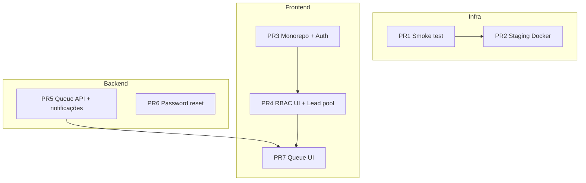

# Roadmap pós-segurança — PRs de produto

Plano de entrega após PRs 1–11 (segurança) e Fases 2–3 (RBAC).

## Visão geral

## PRs

| PR | Branch | Escopo | Depende de |
|----|--------|--------|------------|
| **PR1** | `feat/smoke-test-roadmap` | Script smoke test + este doc | — |
| **PR2** | `feat/staging-docker-compose` | `docker-compose.staging.yml`, env staging | — |
| **PR3** | `feat/frontend-auth-foundation` | Frontend no monorepo, login, JWT, API client, middleware | — |
| **PR4** | `feat/frontend-rbac-ui` | Register fix, members, lead pool, nav por role | PR3 |
| **PR5** | `feat/backend-queue-rbac` | `GET /api/queue/interactions`, escopo AGENT, notificações filtradas | — |
| **PR6** | `feat/backend-password-reset` | Forgot/reset password, convite com token | — |
| **PR7** | `feat/frontend-queue-readme` | Fila WhatsApp wired, README full-stack | PR4, PR5 |

## Definition of done (produto utilizável)

- [ ] Admin registra empresa e convida vendedores
- [ ] Vendedor faz login e vê só seus leads + pool para claim
- [ ] Admin/Manager atribui leads e gerencia equipe
- [ ] Fila WhatsApp lista interações reais (escopo por vendedor)
- [ ] Smoke test passa contra stack staging
- [ ] CI verde (backend + frontend build)

## Fora de escopo (backlog)

- Stripe Customer Portal completo no frontend
- E-mail transacional real (SMTP prod) para convites
- Refresh token / OAuth social
- MANAGER vê só equipe (subordinados) — requer hierarquia
- Testes E2E Playwright
